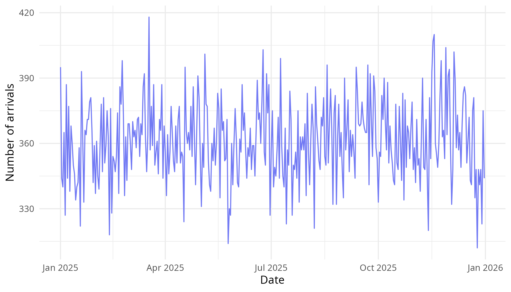
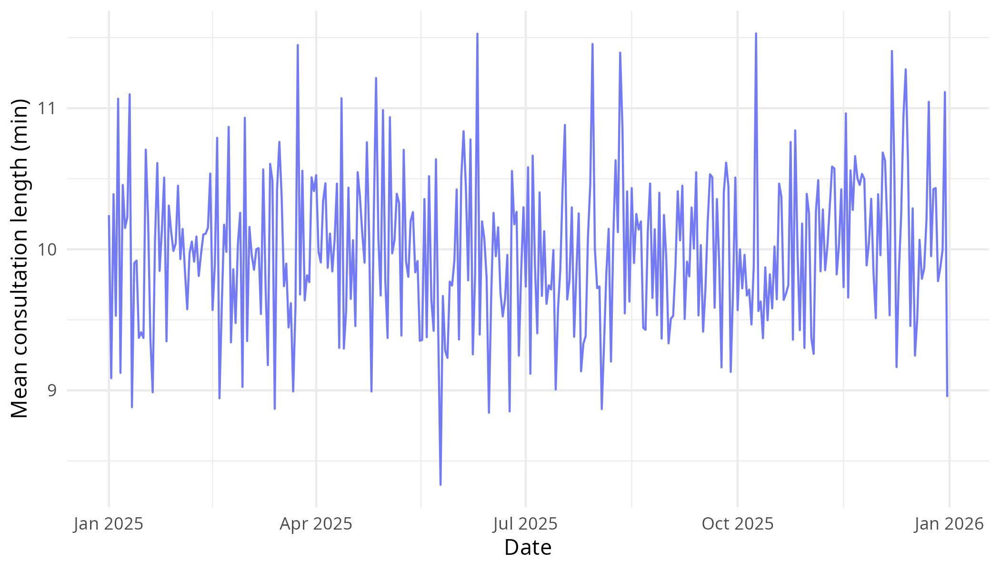
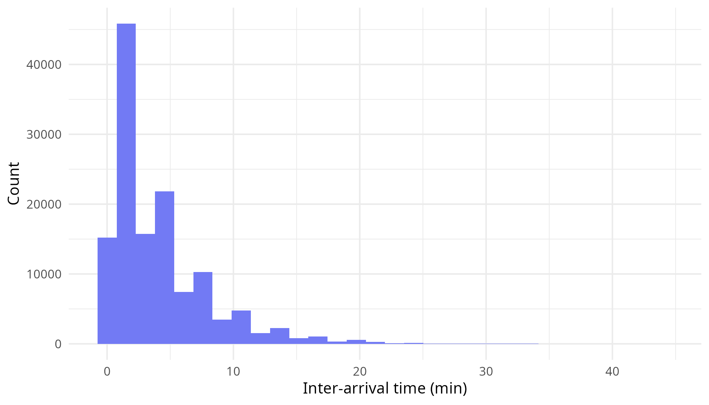
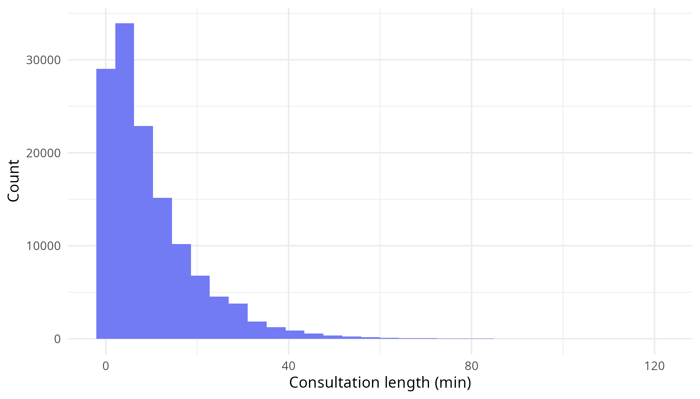
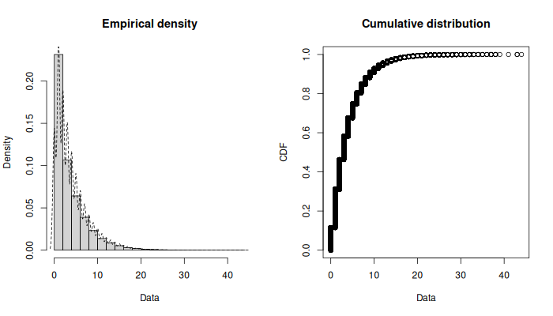
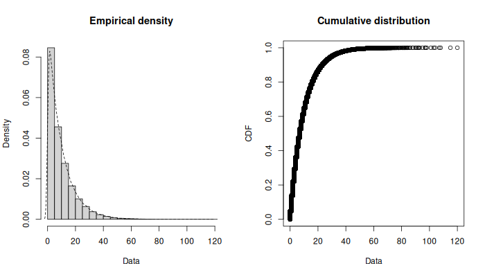
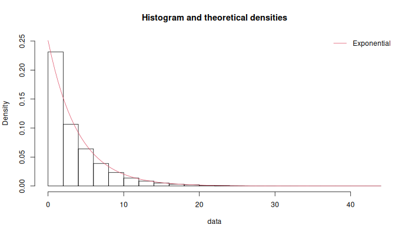
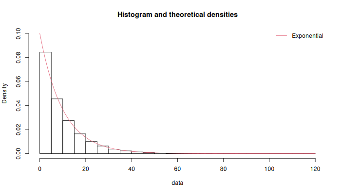
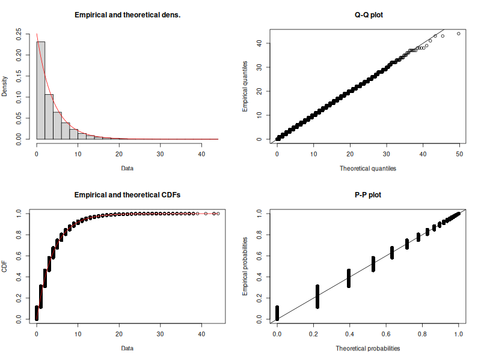

Input modelling
================
Amy Heather
2025-05-15

- [Input modelling](#input-modelling)
  - [Set-up](#set-up)
  - [Both workflows: Identify relevant
    distributions](#both-workflows-identify-relevant-distributions)
  - [Targeted approach](#targeted-approach)
  - [Comprehensive approach](#comprehensive-approach)
  - [Plots](#plots)
  - [Parameters](#parameters)

# Input modelling

This notebook shows a basic workflow for choosing probability
distributions.

Here, we already know which distributions to use (as we sampled from
them to create our synthetic data), but the steps illustrate how you
might select distributions in practice with real data.

1.  **Identify possible distributions**. Appropriate distributions can
    be based on knowledge of the process being modelled, but it’s also
    very important to look at the data using time series plots and
    histograms.
2.  **Fit distributions and calculate goodness-of-fit**. You can either
    use:
    - **Targeted approach**: Test specific distributions you identified
      in step 1 .
    - **Comprehensive approach**: Test a wide range of candidate
      distributions simultaneously.
3.  **Evaluate fit**. Check goodness-of-fit statistics, but also
    consider which distributions make sense in context (e.g., simpler
    distributions may be preferable when they provide adequate fit).

It’s still important to do step 1 even if taking a comprehensive
approach, as when testing lots of distributions using a tool it:

- Won’t notify you have **temporal patterns** (e.g. spikes in service
  length every Friday).
- May suggest distributions which mathematically fit but **contextually
  are inappropriate** (e.g. normal distribution for service times, which
  can’t be negative).
- Overfitting - suggesting complex distributions even when **simpler are
  sufficient**.

## Set-up

``` r
# nolint start: undesirable_function_linter
# Import required packages
library(dplyr)
library(fitdistrplus)
library(ggplot2)
library(knitr)
library(lubridate)
library(plotly)
library(readr)
library(tidyr)
# nolint end
```

``` r
# Define path to outputs
output_dir <- file.path("..", "outputs")
```

``` r
# Import data
data <- read_csv(
  file.path("..", "inputs", "NHS_synthetic.csv"), show_col_types = FALSE
)

# Preview data
head(data)
```

    ## # A tibble: 6 × 6
    ##   ARRIVAL_DATE ARRIVAL_TIME SERVICE_DATE SERVICE_TIME DEPARTURE_DATE
    ##   <date>       <chr>        <date>       <chr>        <date>        
    ## 1 2025-01-01   0001         2025-01-01   0007         2025-01-01    
    ## 2 2025-01-01   0002         2025-01-01   0004         2025-01-01    
    ## 3 2025-01-01   0003         2025-01-01   0010         2025-01-01    
    ## 4 2025-01-01   0007         2025-01-01   0014         2025-01-01    
    ## 5 2025-01-01   0010         2025-01-01   0012         2025-01-01    
    ## 6 2025-01-01   0010         2025-01-01   0011         2025-01-01    
    ## # ℹ 1 more variable: DEPARTURE_TIME <chr>

Calculate inter-arrival times.

``` r
data <- data %>%
  # Combine date/time and convert to datetime
  mutate(arrival_datetime = ymd_hm(paste(ARRIVAL_DATE, ARRIVAL_TIME))) %>%
  # Sort by arrival time
  arrange(arrival_datetime) %>%
  # Calculate inter-arrival times
  mutate(
    iat_mins = as.numeric(
      difftime(
        arrival_datetime, lag(arrival_datetime), units = "mins"
      )
    )
  )

# Preview
data %>%
  select(ARRIVAL_DATE, ARRIVAL_TIME, arrival_datetime, iat_mins) %>%
  head()
```

    ## # A tibble: 6 × 4
    ##   ARRIVAL_DATE ARRIVAL_TIME arrival_datetime    iat_mins
    ##   <date>       <chr>        <dttm>                 <dbl>
    ## 1 2025-01-01   0001         2025-01-01 00:01:00       NA
    ## 2 2025-01-01   0002         2025-01-01 00:02:00        1
    ## 3 2025-01-01   0003         2025-01-01 00:03:00        1
    ## 4 2025-01-01   0007         2025-01-01 00:07:00        4
    ## 5 2025-01-01   0010         2025-01-01 00:10:00        3
    ## 6 2025-01-01   0010         2025-01-01 00:10:00        0

Calculate service times.

``` r
data <- data %>%
  mutate(
    service_datetime   = ymd_hm(paste(SERVICE_DATE, SERVICE_TIME)),
    departure_datetime = ymd_hm(paste(DEPARTURE_DATE, DEPARTURE_TIME)),
    service_mins = as.numeric(
      difftime(departure_datetime, service_datetime, units = "mins")
    )
  )

# Preview
data %>% select(service_datetime, departure_datetime, service_mins) %>% head()
```

    ## # A tibble: 6 × 3
    ##   service_datetime    departure_datetime  service_mins
    ##   <dttm>              <dttm>                     <dbl>
    ## 1 2025-01-01 00:07:00 2025-01-01 00:12:00            5
    ## 2 2025-01-01 00:04:00 2025-01-01 00:07:00            3
    ## 3 2025-01-01 00:10:00 2025-01-01 00:30:00           20
    ## 4 2025-01-01 00:14:00 2025-01-01 00:22:00            8
    ## 5 2025-01-01 00:12:00 2025-01-01 00:31:00           19
    ## 6 2025-01-01 00:11:00 2025-01-01 00:14:00            3

## Both workflows: Identify relevant distributions

First, we consider our **knowledge about the process being modelled**.
In this case, we have random arrivals and service times in a queueing
model, which are often modelled using exponential distributions.

Then, we **inspect the data** in two different ways:

| Plot type | What does it show? | Why do we create this plot? |
|----|----|----|
| **Time series** | Trends, seasonality, and outliers (e.g., spikes or dips over time). | To check for **stationarity** (i.e. no trends or sudden changes). Stationary is an assumption of many distributions, and if trends or anomalies do exist, we may need to exclude certain periods or model them separately. The time series can also be useful for spotting outliers and data gaps. |
| **Histogram** | The shape of the data’s distribution. | Helps **identify which distributions might fit** the data. |

We repeat this for arrivals and service time, so have created a function
to avoid duplicate code between each.

**Time series**. For this data, we observe no trends, seasonality or
outliers.

``` r
inspect_time_series <- function(
  time_series, date_col, value_col, y_lab, interactive, save_path = NULL
) {
  #' Plot time-series
  #'
  #' @param time_series Dataframe with date column and numeric column to plot.
  #' @param date_col String. Name of column with dates.
  #' @param value_col String. Name of column with numeric values.
  #' @param y_lab String. Y axis label.
  #' @param interactive Boolean. Whether to render interactive or static plot.
  #' @param save_path String. Path to save static file to (inc. name and
  #' filetype). If NULL, then will not save.

  # Create custom tooltip text
  time_series$tooltip_text <- paste0(
    "<span style='color:white'>",
    "Date: ", time_series[[date_col]], "<br>",
    y_lab, ": ", time_series[[value_col]], "</span>"
  )

  # Create plot
  p <- ggplot(time_series, aes(x = .data[[date_col]],
                               y = .data[[value_col]],
                               text = tooltip_text)) +  # nolint: object_usage_linter
    geom_line(group = 1L, color = "#727af4") +
    labs(x = "Date", y = y_lab) +
    theme_minimal()

  # Save file if path provided
  if (!is.null(save_path)) {
    ggsave(save_path, p, width = 7L, height = 4L)
  }

  # Display as interactive or static figure
  if (interactive) {
    ggplotly(p, tooltip = "text", width = 700L, height = 400L)
  } else {
    p
  }
}
```

``` r
# Plot daily arrivals
path <- file.path(output_dir, "input_model_daily_arrivals.png")
daily_arrivals <- data %>% group_by(ARRIVAL_DATE) %>% count()
p <- inspect_time_series(
  time_series = daily_arrivals, date_col = "ARRIVAL_DATE", value_col = "n",
  y_lab = "Number of arrivals", interactive = FALSE, save_path = path
)
include_graphics(path)
```

<!-- -->

``` r
# Calculate mean service length per day, dropping last day (incomplete)
daily_service <- data %>%
  group_by(SERVICE_DATE) %>%
  summarise(mean_service = mean(service_mins)) %>%
  filter(row_number() <= n() - 1L)

# Plot mean service length each day
path <- file.path(output_dir, "input_model_mean_service.png")
p <- inspect_time_series(
  time_series = daily_service, date_col = "SERVICE_DATE",
  value_col = "mean_service", y_lab = "Mean consultation length (min)",
  interactive = FALSE, save_path = path
)
include_graphics(path)
```

<!-- -->

**Histogram**. For both inter-arrival times and service times, we
observe a right skewed distribution. Hence, it would be good to try
exponential, gamma and Weibull distributions.

``` r
inspect_histogram <- function(
  data, var, x_lab, interactive, save_path = NULL
) {
  #' Plot histogram
  #'
  #' @param data A dataframe or tibble containing the variable to plot.
  #' @param var String. Name of the column to plot as a histogram.
  #' @param x_lab String. X axis label.
  #' @param interactive Boolean. Whether to render interactive or static plot.
  #' @param save_path String. Path to save static file to (inc. name and
  #' filetype). If NULL, then will not save.

  # Remove non-finite values
  data <- data[is.finite(data[[var]]), ]

  # Create plot
  p <- ggplot(data, aes(x = .data[[var]])) +
    geom_histogram(aes(text = paste0("<span style='color:white'>", x_lab, ": ",
                                     round(after_stat(x), 2L), "<br>Count: ",  # nolint: object_usage_linter
                                     after_stat(count), "</span>")),
                   fill = "#727af4", bins = 30L) +
    labs(x = x_lab, y = "Count") +
    theme_minimal() +
    theme(legend.position = "none")

  # Save file if path provided
  if (!is.null(save_path)) {
    ggsave(save_path, p, width = 7L, height = 4L)
  }

  # Display as interactive or static figure
  if (interactive) {
    ggplotly(p, tooltip = "text", width = 700L, height = 400L)
  } else {
    p
  }
}
```

``` r
# Plot histogram of inter-arrival times
path <- file.path(output_dir, "input_model_hist_iat.png")
p <- inspect_histogram(
  data = data, var = "iat_mins", x_lab = "Inter-arrival time (min)",
  interactive = FALSE, save_path = path
)
include_graphics(path)
```

<!-- -->

``` r
# Plot histogram of service times
path <- file.path(output_dir, "input_model_hist_service.png")
p <- inspect_histogram(
  data = data, var = "service_mins", x_lab = "Consultation length (min)",
  interactive = FALSE, save_path = path
)
include_graphics(path)
```

<!-- -->

**Alternative:** You can use the `fitdistrplus` package to create these
histograms - as well as the empirical cumulative distribution function
(CDF), which can help you inspect the tails, central tendency, and spot
jumps or plateaus in the data.

``` r
# Get IAT and service time columns as numeric vectors (with NA dropped)
data_iat <- data %>% drop_na(iat_mins) %>% select(iat_mins) %>% pull()
data_service <- data %>% select(service_mins) %>% pull()

# Plot histograms and CDFs
path <- file.path(output_dir, "input_model_hist_dist_iat.png")
png(path, width = 700L, height = 400L)
plotdist(data_iat, histo = TRUE, demp = TRUE)
dev.off()
```

    ## png 
    ##   2

``` r
include_graphics(path)
```

<!-- -->

``` r
path <- file.path(output_dir, "input_model_hist_dist_service.png")
png(path, width = 700L, height = 400L)
plotdist(data_service, histo = TRUE, demp = TRUE)
dev.off()
```

    ## png 
    ##   2

``` r
include_graphics(path)
```

<!-- -->

## Targeted approach

Fit our chosen statistical distributions (exponential, gamma, weibull)
to the data and assess goodness-of-fit. A common test to use is the
**Kolmogorov-Smirnov (KS) Test**, which is well-suited to continuous
distributions. For categorical (or binned) data, consider using a
**chi-squared tests**.

The KS Test returns a statistic and p value.

- **Statistic:** Measures how well the distribution fits your data.
  - **Higher values indicate a better fit**.
  - Ranges from 0 to 1.
- **P-value:** Tells you if the fit could have happened by chance.
  - **Higher p-values suggest the data follow the distribution**.
  - In large datasets, even good fits often have small p-values.
  - Ranges from 0 to 1.

We have several of zeros (as times are rounded to nearest minute, and
arrivals are frequent / service times can be short). Weibull is only
defined for positive values, so we won’t try that. We have built in
error-handling to `fit_distributions` to ensure that.

``` r
# Percentage of inter-arrival times that are 0
paste0(round(sum(data_iat == 0L) / length(data_iat) * 100L, 2L), "%")
```

    ## [1] "11.55%"

``` r
paste0(round(sum(data_service == 0L) / length(data_service) * 100L, 2L), "%")
```

    ## [1] "4.8%"

``` r
fit_distributions <- function(data, dists) {
  #' Compute Kolmogorov-Smirnov Statistics for Fitted Distributions
  #'
  #' @param data Numeric vector. The data to fit distributions to.
  #' @param dists Character vector. Names of distributions to fit.
  #'
  #' @return Named numeric vector of Kolmogorov-Smirnov statistics, one per
  #' distribution.

  # Define distribution requirements
  positive_only <- c("lnorm", "weibull")
  non_negative <- c("exp", "gamma")
  zero_to_one <- "beta"

  # Check data characteristics
  has_negatives <- any(data < 0L)
  has_zeros <- any(data == 0L)
  has_out_of_beta_range <- any(data < 0L | data > 1L)

  # Filter distributions based on data
  valid_dists <- dists
  if (has_negatives || has_zeros) {
    valid_dists <- setdiff(valid_dists, positive_only)
  }
  if (has_negatives) {
    valid_dists <- setdiff(valid_dists, non_negative)
  }
  if (has_out_of_beta_range) {
    valid_dists <- setdiff(valid_dists, zero_to_one)
  }

  # Warn about skipped distributions
  skipped <- setdiff(dists, valid_dists)
  if (length(skipped) > 0L) {
    warning("Skipped distributions due to data constraints: ",
            toString(skipped), call. = FALSE)
  }

  # Exit early if no valid distributions remain
  if (length(valid_dists) == 0L) {
    warning("No valid distributions to test after filtering", call. = FALSE)
    return(numeric(0L))
  }

  # Fit remaining distributions
  fits <- lapply(
    valid_dists, function(dist) suppressWarnings(fitdist(data, dist))
  )
  gof_results <- gofstat(fits, fitnames = valid_dists)

  # Return KS statistics
  gof_results$ks
}


distributions <- c("exp", "gamma", "weibull")
fit_distributions(data_iat, distributions)
```

    ## Warning: Skipped distributions due to data constraints: weibull

    ##       exp     gamma 
    ## 0.1154607 0.2061950

``` r
fit_distributions(data_service, distributions)
```

    ## Warning: Skipped distributions due to data constraints: weibull

    ##        exp      gamma 
    ## 0.04796992 0.09755396

Unsurprisingly, the best fit for both is the **exponential
distribution** (lowest test statistic).

We can create a version of our histograms from before but with the
distributions overlaid, to visually support this. The simplest way to do
this is to just use the plotting functions from `fitdistrplus`.

``` r
# Fit and create plot for IAT
iat_exp <- suppressWarnings(fitdist(data_iat, "exp"))
path <- file.path(output_dir, "input_model_hist_exp_iat.png")
png(path, width = 700L, height = 400L)
denscomp(iat_exp, legendtext = "Exponential")
dev.off()
```

    ## png 
    ##   2

``` r
include_graphics(path)
```

<!-- -->

``` r
# Fit and create plot for service
ser_exp <- suppressWarnings(fitdist(data_service, "exp"))
path <- file.path(output_dir, "input_model_hist_exp_service.png")
png(path, width = 700L, height = 400L)
denscomp(ser_exp, legendtext = "Exponential")
dev.off()
```

    ## png 
    ##   2

``` r
include_graphics(path)
```

<!-- -->

## Comprehensive approach

The `fitdistrplus` package does not have a built-in function to
automatically fit a large set of distributions in a single command.
Instead, we just need to specify a list of candidate distributions.

Again, **exponential** is returned as the best fit.

``` r
# Continuous distributions supported natively by fitdist
# (you could use other packages to get other distributions to test)
distributions <- c("norm", "lnorm", "exp", "cauchy", "gamma", "logis", "beta",
                   "weibull", "unif")
fit_distributions(data_iat, distributions)
```

    ## Warning: Skipped distributions due to data constraints: lnorm, beta, weibull

    ##      norm       exp    cauchy     gamma     logis      unif 
    ## 0.1796464 0.1154607 0.1968200 0.2061950 0.1564321 0.7036682

``` r
fit_distributions(data_service, distributions)
```

    ## Warning: Skipped distributions due to data constraints: lnorm, beta, weibull

    ##       norm        exp     cauchy      gamma      logis       unif 
    ## 0.15810466 0.04796992 0.19728636 0.09755396 0.15566197 0.71336153

## Plots

The `fitdistrplus` package also has some nice visualisation functions.

``` r
iat_exp <- suppressWarnings(fitdist(data_iat, "exp"))

path <- file.path(output_dir, "input_model_iat_exp.png")
png(path, width = 800L, height = 600L)
plot(iat_exp)
dev.off()
```

    ## png 
    ##   2

``` r
include_graphics(path)
```

<!-- -->

## Parameters

The exponential distribution is defined by a single parameter, but this
parameter can be expressed in two ways - as the:

- **Mean** (also called the **scale**) - this is just your sample mean.
- **Rate** (also called **lambda** λ) - this is calculated as
  `1 / mean`.

We will use the `rexp()` function from the `stats` package which
requires the **rate** parameter, not the mean.

Rate:

- Inter-arrival time: 0.25
- Service time: 0.1

``` r
1 / mean(data_iat)
```

    ## [1] 0.2509813

``` r
1 /mean(data_service)
```

    ## [1] 0.1000844
